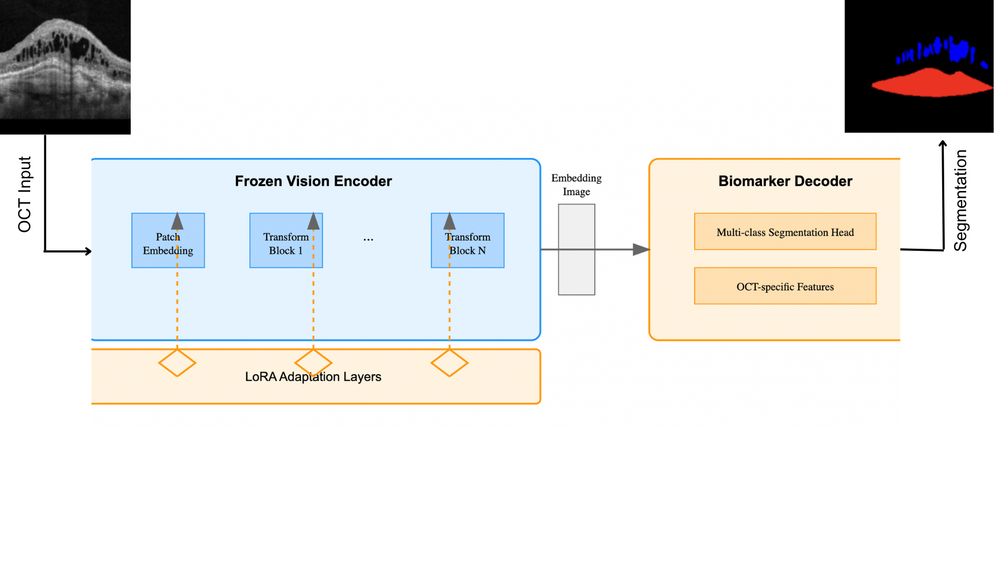
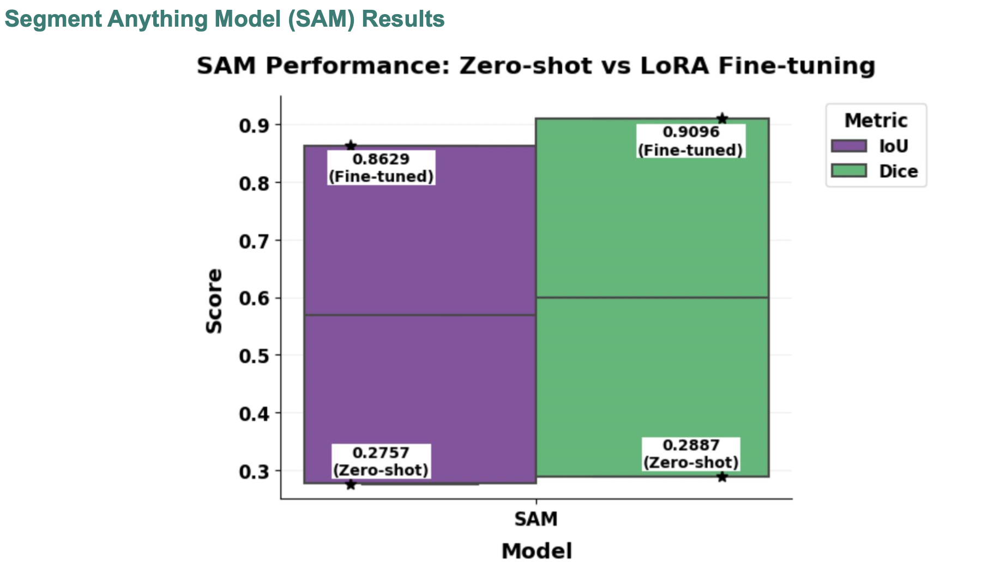
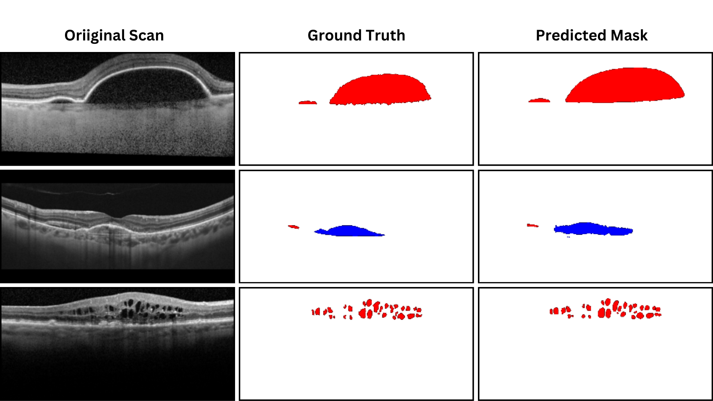
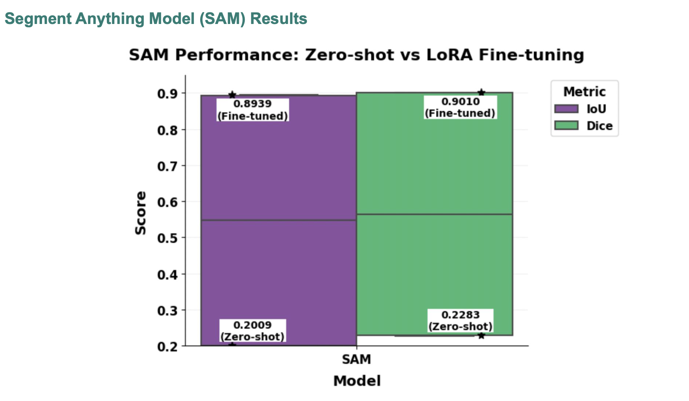
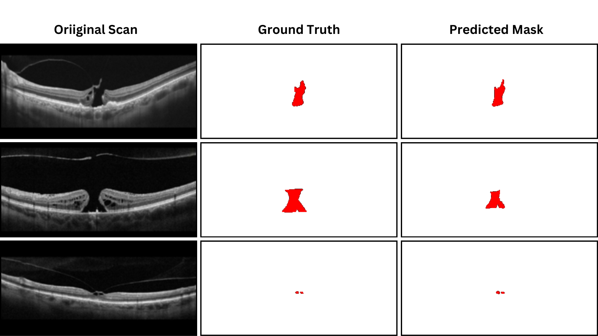

## Motivation

Segment Anything Model (SAM) is a powerful vision foundation model, but **zero-shot segmentation** often fails on domain-specific medical images like OCT scans.  
To address this, we applied **LoRA-based fine-tuning** of SAM for **biomarker segmentation** in OCT scans of **Age-related Macular Degeneration (AMD)** and **Macular Hole**.  

This work demonstrates:
- Why SAM alone is insufficient in medical imaging without adaptation.  
- How lightweight **LoRA adapters** enable fine-tuning with limited data.  
- Significant performance gains (Dice / IoU) compared to SAM zero-shot.

## Dataset & Preprocessing

We used the same OCT datasets as in the [OCT-Biomarker-Segmentation](https://github.com/Keshav0781/OCT-Biomarker-Segmentation) project:  
- **Age-related Macular Degeneration (AMD)**  
- **Macular Hole**  

Each dataset contains manually annotated B-scans with pixel-wise masks for clinically relevant biomarkers (e.g., drusen, intra-/sub-retinal fluid, tissue defects).  

**Preprocessing for SAM**  
- OCT B-scans were resized to **1024×1024 RGB** to match SAM’s input requirements.  
- Standard **data augmentation** (random flips, rotations, brightness/contrast) was applied during training.  

> For visual dataset distributions and annotation examples, see the [previous repository](https://github.com/Keshav0781/OCT-Biomarker-Segmentation).

## Methodology — SAM + LoRA Fine-tuning

The **Segment Anything Model (SAM)** provides strong image segmentation priors but struggles in the OCT domain.  
To adapt it, we used **Low-Rank Adaptation (LoRA)**, a lightweight fine-tuning technique that injects trainable rank-decomposition matrices into specific attention layers.

<div align="center">
  <br>
  <b>Figure: SAM architecture with LoRA fine-tuning (image encoder + prompt encoder + mask decoder)</b>
</div>

### Why LoRA?
- SAM has **hundreds of millions of parameters**, making full fine-tuning impractical.  
- LoRA fine-tunes only a small number of additional parameters, keeping training efficient and memory-friendly.  
- This enables effective adaptation to OCT biomarker segmentation with limited annotated data.

### Training setup
- **Backbone**: Vision Transformer encoder from SAM.  
- **LoRA rank**: 16 (applied to attention projections).  
- **Optimizer**: AdamW with learning rate = 1e-4.  
- **Batch size**: 16.  
- **Epochs**: up to 50 with early stopping (patience = 5).  
- **Loss**: Dice loss + Cross-entropy combination.  
- **Datasets**: AMD and Macular Hole OCT B-scans, resized to 1024×1024.  

> The training was performed separately for AMD and Macular Hole datasets, producing disease-specific SAM + LoRA checkpoints.


## Results — SAM (LoRA) Fine-tuning

This section summarizes the SAM + LoRA fine-tuning results for OCT biomarker segmentation (AMD and Macular Hole). Numeric results (Mean IoU and Mean Dice) were taken from the presentation/thesis and are provided here; the full CSVs are available in `results/`.

### AMD — SAM (LoRA)
| Method | Mean IoU | Mean Dice |
|---|---:|---:|
| SAM (zero-shot) | 0.2757 | 0.2887 |
| SAM + LoRA (fine-tuned) | 0.8629 | 0.9096 |

> Download CSV: [results/amd/sam_lora_performance.csv](results/amd/sam_lora_performance.csv)

<div>
  <table>
    <tr>
      <td align="center">
        <br>
        <b>AMD — IoU / Dice (Zero-shot vs LoRA)</b>
      </td>
      <td align="center">
        <br>
        <b>AMD — Example qualitative output (LoRA fine-tuned)</b>
      </td>
    </tr>
  </table>
</div>

---

### Macular Hole — SAM (LoRA)
| Method | Mean IoU | Mean Dice |
|---|---:|---:|
| SAM (zero-shot) | 0.2009 | 0.2283 |
| SAM + LoRA (fine-tuned) | 0.8939 | 0.9010 |

> Download CSV: [results/macular_hole/sam_lora_performance.csv](results/macular_hole/sam_lora_performance.csv)

<div>
  <table>
    <tr>
      <td align="center">
        <br>
        <b>Macular Hole — IoU / Dice (Zero-shot vs LoRA)</b>
      </td>
      <td align="center">
        <br>
        <b>Macular Hole — Example qualitative output (LoRA fine-tuned)</b>
      </td>
    </tr>
  </table>
</div>

---
## How to Run / Reproduce

### Requirements
- Python 3.8+
- PyTorch ≥ 1.10
- torchvision
- [segment-anything](https://github.com/facebookresearch/segment-anything)
- [peft](https://github.com/huggingface/peft) (for LoRA fine-tuning)
- transformers
- matplotlib, numpy, scikit-learn

### Installation
Clone this repository and install dependencies:

```bash
git clone https://github.com/Keshav0781/OCT-SAM-FineTuning-LoRA.git
cd OCT-SAM-FineTuning-LoRA
pip install -r requirements.txt
```

